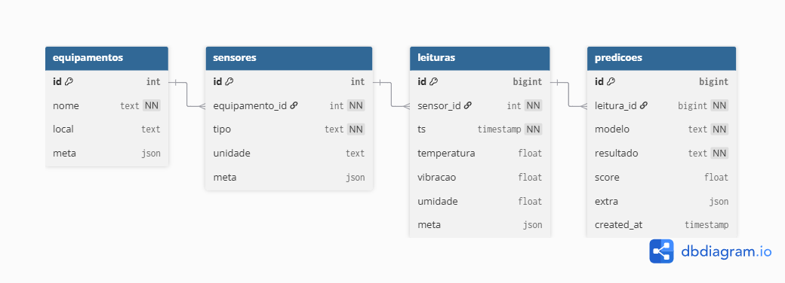
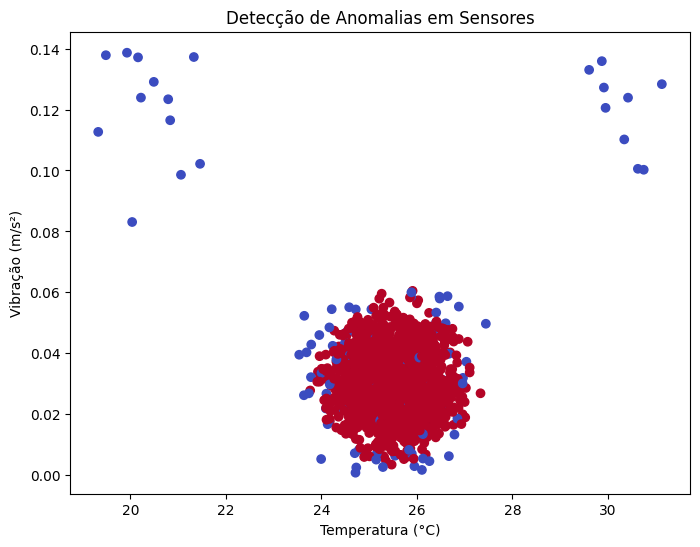

# 🚀 Desafio Empresarial 5 — Hermes Reply

Este repositório corresponde à **Fase 5** do desafio em parceria com a empresa **Hermes Reply**, no curso de **Tecnologia da FIAP**.  
É uma **continuação** do repositório [enterprise-challenge-2](https://github.com/TeamFiapAI/enterprise-challenge-2), avançando para a etapa de **modelagem de banco de dados** e **introdução ao Machine Learning (ML)**.

---

## 🎯 Objetivos
Transformar os dados coletados ou simulados nas fases anteriores em:  
- ✅ Um **modelo de banco de dados relacional** (DER + script SQL).  
- ✅ Um **conjunto de dados simulado em CSV** com pelo menos 500 leituras por sensor.  
- ✅ **Notebooks em Python (Google Colab)** para treino de modelo básico de ML (classificação ou detecção de anomalias).  
- ✅ **Gráfico** que ilustra o resultado do modelo.  
- ✅ **Documentação clara** explicando todo o processo.  
---

## 📂 Estrutura do Repositório

sql/ -> Script SQL de criação das tabelas (schema.sql)
data/ -> Dataset simulado (sensor_readings.csv)
diagrams/ -> Diagrama Entidade-Relacionamento (DER) exportado em PNG
notebooks/ -> Notebooks em Colab (geração de CSV, treino de ML, inferência)
models/ -> Modelo treinado (model.joblib)
README.md -> Este documento

---

## 🛠 Tecnologias Utilizadas
- 📌 **Modelagem ER**: dbdiagram.io (export para PNG e SQL)  
- 🗄 **Banco de Dados**: PostgreSQL (script inicial pronto; opcional rodar em Neon ou Supabase)  
- 🐍 **Python / Google Colab**: Pandas, NumPy, Scikit-learn, Matplotlib, SQLAlchemy  
- 🔗 **Controle de versão**: GitHub  

---

## 🗂 Modelagem de Dados
O modelo de dados foi construído de forma **normalizada e simples**, com quatro entidades principais:  
- 🏭 **equipamentos** → cadastro dos equipamentos monitorados.  
- 📟 **sensores** → lista de sensores associados a cada equipamento (tipo, unidade).  
- 📊 **leituras** → registros coletados (temperatura, vibração, umidade, timestamp).  
- 🤖 **predicoes** → resultados de modelos de ML aplicados sobre as leituras.  

📌 O **Diagrama Entidade-Relacionamento (DER)** está disponível em `diagrams/der.png`.  
📌 O **script SQL** encontra-se em `sql/schema.sql`.  

---

## 📊 Dataset
📁 Arquivo: `data/sensor_readings.csv`  
⚙️ Gerado artificialmente no notebook `01_gera_csv.ipynb`.  

Cada sensor possui **≥ 500 leituras**, com:  
- ⏱ Timestamp (`ts`)  
- 🌡 Temperatura (°C)  
- 📈 Vibração (m/s²)  
- 💧 Umidade (%)  
- 🔖 Metadados (`equipamento`, `sensor_id`, `tipo`, `unidade`)  

---

## 🤖 Machine Learning
O modelo de ML foi implementado em **Google Colab** usando Scikit-learn.  
Foram testadas **duas abordagens**:  

### 🔹 Opção A — Detecção de Anomalias
- Modelo: *Isolation Forest*.  
- Justificativa: identificar leituras atípicas de sensores (manutenção preditiva).  
- Resultados: percentual de anomalias detectadas (**preencher após execução**).  
- Gráfico gerado: `notebooks/fig_temperatura_anomalias.png`.  

---

## 📊 Resultados

### 🗂 Modelo de Banco de Dados
O diagrama abaixo mostra a modelagem do banco de dados relacional criada para armazenar as leituras dos sensores:

  

---

### 🤖 Machine Learning — Detecção de Anomalias
O gráfico abaixo mostra as leituras normais e anômalas detectadas pelo modelo **Isolation Forest**:

  

Como configuramos `contamination=0.05`, o modelo classificou aproximadamente **5% das leituras como anomalias**, o que é coerente com o esperado.  
Essas anomalias podem indicar:
- Leituras incorretas dos sensores,  
- Condições fora do padrão esperado,  
- Ou potenciais falhas de equipamento.  

---

---

## ▶️ Vídeo de Apresentação
🎥 Link para o vídeo (YouTube não listado): **[ADICIONAR AQUI]**  

**Roteiro sugerido (até 5 min):**  
1. 📌 Contexto e objetivos (30s)  
2. 🗂 DER: entidades e justificativas (1 min)  
3. 📊 Dataset em CSV (45s)  
4. 🤖 Modelo de ML e gráfico (1m30s)  
5. ✅ Resultados e próximos passos (45s)  

---

## ✅ Checklist da Entrega
- [x] DER completo + imagem exportada  
- [x] Script SQL (`schema.sql`)  
- [x] Dataset CSV (`sensor_readings.csv`)  
- [x] Notebooks Colab com código de ML  
- [x] Gráfico(s) de resultado  
- [x] Documentação clara (README)  
- [x] Vídeo explicativo (até 5 min, link não listado)  

---
